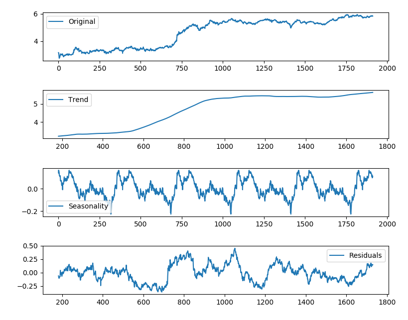

Looking for trends in the stock's prices and proxies of their patterns
==========================

This project aims at making predictions of stock's prices and provide a confidence interval for those predictions. The latter can give you a feeling of the range of real possible outcomes that an observation in the next time step may take. We are in particular interested to asses **whether we can find independent proxies of trends/patterns of the stock's prices**.

One method for analyzing and predicting periodic data is the additive model. The idea is to find patterns underlying noisy data, e.g. on a daily, weekly or seasonally basis, as well an underlying trend of the data. Unveiling this trend can be very useful in separating a stochastic behaviour of the data from a deterministic one. We are interested in the latter, e.g. to determine whether the price of a commodity or stock will increase or decrease in the next time step(s).

We used the Python package Prophet to make a forecasting for stock prices. While we analyzed several stock prices, here - as an example - we shall consider only the historical Tesla's stock prices fetched using the Quandl library. Tesla manufactures world premium electric vehicles. Company had gone public in 2010 and became ultimate sought by all investors after rocketing its price by more than 700 % since the first day of trading.

First, we aim at determining if the previous stock's prices show some trend. For this purpose, we implement the Augmented Dickey-Fuller test to check whether time series is stationary or non-stationary, or -  in different words - how strongly a time series is defined by a trend underlying noisy data.

Null Hypothesis (H0): the time series has some time-dependent trend.
Alternate Hypothesis (H1): the time series is stationary.

We interpret this result using the p-values, that is a p-value below a fixed threshold (e.g. 1%) indicates that we reject the null hypothesis, otherwise a p-value above that threshold indicates that we accept the null hypothesis. The Dickey-Fuller test statistic in our case is close to unity. So this stock prices are far from stationary, and we have likely an underlying trend to unveil and to disentangle from other patterns and noise.

In particular, we decompose the stock prices as a combination of level, trend, seasonality, and noise components, that is an additive model which reads:

	
stock_price(t) = Level + Trend + Seasonality + Noise

The following image shows the observation of the stock price as the superimposition of a trend, season pattern, and residuals.
 

We used Prophet to fit an additive model where non-linear trends are fit with yearly and weekly seasonality.  Unlike typical time-series methods like ARIMA, Prophet uses separate components for the trend, yearly seasonality, and weekly seasonality in the time series.

Here are the results. The black dots represent the real stock prices, the blue line indicates the predicted values, and the light blue shaded region is the confidence level. Note that the region of uncertainty increases the further out in the future the prediction is made, since the time-zero uncertainty propagates and grows over time. This limit our ability to make forecast for the next time step(s).

It would be useful to find some independent proxy of the aforementioned trends or pattern. For example, we may conjecture that the oil price correlate with the number of people searching gas prices in GasBuddy. In our case, the stock price of a car company may correlate with the number of potential costumers seeking online information on that company, or with the info from Social Media (Twitter, Facebook etc.). We cross-check the Google Search Trends, looking for "Tesla Motor" in the same time range of the stocks, to look for correlations. We defined critical points time periods with absolute fractional variation larger than a fixed threshold - a quick rise or descrease of the price stocks (vertical red dotted lines)- , and compare it to the Google Search trend (solid blue line). 

Many of the abrupt changes in the stock's prices line up with changes in for the Google Search of the word "Tesla Motor". However, there are some uncertainties in the association. It would be useful to extend this tentative associations including info from Social Web Service, News etc. to seek for any other meaningful signal of correlation with the stock's prices, e.g.via sentiment analysis.

Capitalizing on these independent proxies of trends/patterns of the stock's prices can help data scientists to navigate on such "treacherous" waters of forecast in time series, with uncertainties that increase the further out in time the prediction is made. While there is clearly no predictable pattern we can learn from this on a hourly or daily basis, **the possibility to predict increases/decreases in the stock's prices by looking at these independent proxies is clearly an exciting opportunity**.
